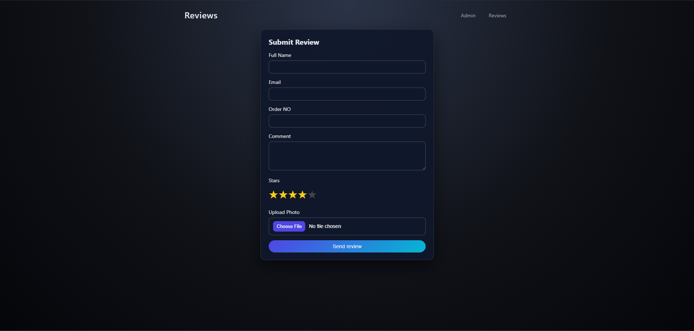
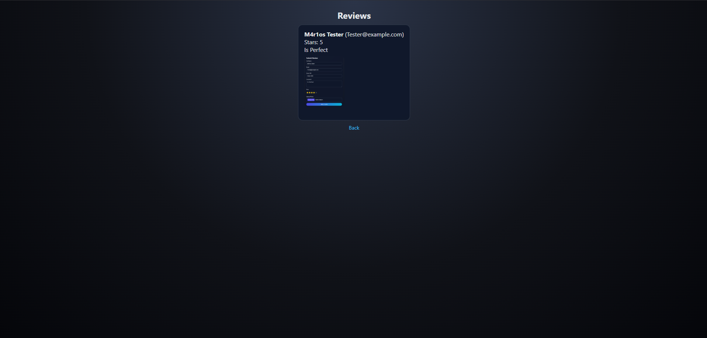
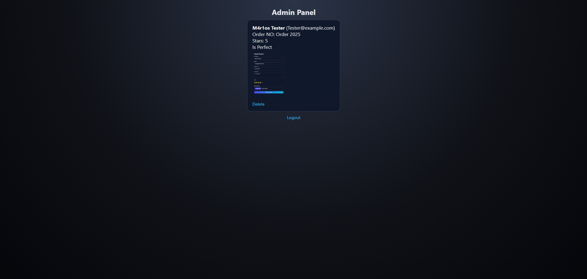

# If you are using Apache remove this block from the index.php

```php
<?php
$path = parse_url($_SERVER['REQUEST_URI'], PHP_URL_PATH);

$allowed = [
    '/',
    '/index.php',
    '/admin.php',
    '/upload.php',
    '/view.php'
];

if (!in_array($path, $allowed)) {
    http_response_code(404);
    include __DIR__ . '/404.php';
    exit;
}
?>
```
This block is only required on Nginx.

For Apache create a .htaccess file and add:

ErrorDocument 404 /404.php

ErrorDocument 500 /500.php


# ⭐ Review Management Web App


This is a simple PHP web app where users can submit reviews with a rating, comment and optional image. The project also includes an admin panel to manage and delete reviews.

This project was made for educational purposes / school project.

---

## What it does
- Users can submit reviews
- Upload an image with their review
- Reviews appear on the home page
- Admin can log in and manage the reviews
- Admin can delete reviews

---

## Files included
```
index.php - Home page with reviews
upload.php - Upload system
dashboard.php - Admin dashboard
admin.php - Admin login
delete.php - Delete review
logout.php - Logout
view.php - View single review
style.css - Page styling
```

---

## Tools Used
- PHP
- HTML / CSS
- Local Server (XAMPP / WAMP / Apache)

---

## How to run it
1. Download or clone the project.
2. Put the files into your server folder (example: htdocs).
3. Open your browser:

   `http://localhost/project-folder/`

---

## Admin Login
```
Username: admin
Password: ****
```
(Modify as needed)

---

## Ideas for improvement
- Better validation & security
- Search reviews
- Edit feature
- Pagination

---

## Why this project?
It demonstrates:
- PHP basics
- Forms and input handling
- File uploads
- Simple CRUD logic
- Admin panel development

Good for school projects or learning PHP.

---

## License
MIT License. Free to use and modify.

## Photos





